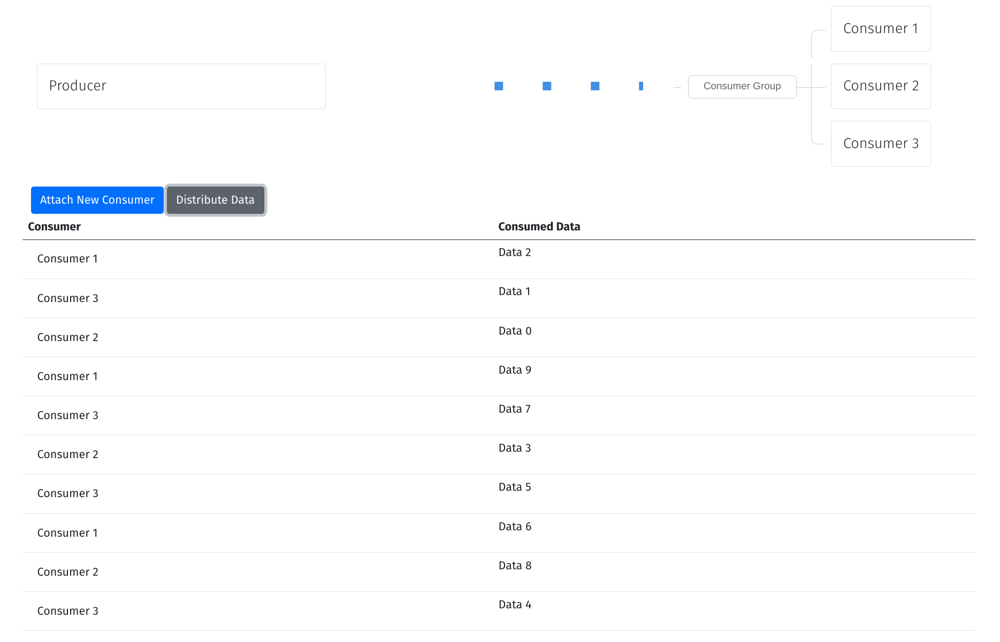

# rabbitmq-example

A demonstration of utilizing RabbitMQ in an event-driven architecture with Golang using the fiber framework, incorporating Server-Sent Events (SSE). This involves creating producers and consumers, managing queues, exchanges, and bindings, and leveraging RabbitMQ to construct microservices that communicate via events.

## Pre-requisites
    - rabbitmq running on localhost:5672 with 
        - default username and password (guest:guest)
        - default vhost (/)

## Run the example

```bash
git clone git@github.com:Chris-Basson-Grundling/rabbitmq-example.git
cd rabbitmq-example
go mod tidy
go run cmd/app.go
```

- Access http://localhost:3000/ in the web browser.

- Select Attach new consumer to create a new consumer

- Select Distribute Data to publish 10 messages to the rabbitmq queue "add"

## Example frontend
